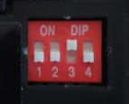

# bleskomat-firmware

This repository contains the source code and basic documentation about how to compile, upload, and test the Bleskomat ATM's firmware.

* [Requirements](#requirements)
	* [Hardware Requirements](#hardware-requirements)
	* [Software Requirements](#software-requirements)
* [Setup](#setup)
	* [Building the Hardware Device](#building-the-hardware-device)
		* [Wiring the E-Paper Module](#wiring-the-e-paper-module)
		* [Wiring the SD Card SPI Module](#wiring-the-sd-card-spi-module)
		* [Wiring the button](#wiring-the-button)
		* [Wiring the Bill Acceptor](#wiring-the-bill-acceptor)
		* [Wiring the Coin Acceptor](#wiring-the-coin-acceptor)
	* [Configure and Train Coin Acceptor](#configure-and-train-coin-acceptor)
	* [Installing Libraries and Dependencies](#installing-libraries-and-dependencies)
	* [Compiling and Uploading to Device](#compiling-and-uploading-to-device)
	* [Prepare SD Card](#prepare-sd-card)
* [Fonts](#fonts)
* [License](#license)


## Requirements

This section includes information about the requirements (software + hardware) that you will need to build the physical Bleskomat ATM.


### Hardware Requirements

The following list includes all the parts needed to build the commercial Bleskomat ATM. The list includes direct links to suppliers of each part.

* [ESP-WROOM-32](https://www.espressif.com/en/products/modules/esp-wroom-32/overview) by espressif
	* [laskarduino.cz](https://www.laskarduino.cz/iot-esp-32s-2-4ghz-dual-mode-wifi-bluetooth-rev-1--cp2102/)
* [WaveShare 4.2 inch E-Paper Module (b/w)](https://www.waveshare.com/wiki/4.2inch_e-Paper_Module):
	* [laskarduino.cz](https://www.laskarduino.cz/waveshare-4-2--400x300-epaper-displej-modul-bw/)
* SD Card SPI Module:
	* [laskarduino.cz](https://www.laskarduino.cz/sd-card-modul-spi/)
* [NV9 Banknote Validator](https://innovative-technology.com/products/products-main/378-nv9-usb-2) from Innovative Technology
	* [COMAX LEISURE CZ,a.s.](https://www.akceptory-bankovek.cz/) (located outside of Prague)
* DG600F Coin Acceptor:
	* [Alibaba.com](https://www.alibaba.com/trade/search?fsb=y&IndexArea=product_en&CatId=&SearchText=DG600F)
	* [Sparkfun.com](https://www.sparkfun.com/products/11636)
* 12V DC power adapter (1.5A < 3A):
	* [2.5A (GME)](https://www.gme.cz/napajeci-zdroj-sitovy-12v-2500ma-5-5-2-1mm-t3-sys1588-3012-t3)
* XL4005 Step-down converter:
	* [laskarduino.cz](https://www.laskarduino.cz/step-down-menic-s-xl4005/)
	* [Alibaba.com](https://www.alibaba.com//trade/search?fsb=y&IndexArea=product_en&CatId=&SearchText=xl4005)
* Button (stainless steel, without LED):
	* [12 mm (GME)](https://www.gme.cz/antivandal-spinac-hbgq12f-10-n)
	* [16 mm (GME)](https://www.gme.cz/antivandal-spinac-hbgq16b-10-s)
	* [22 mm (GME)](https://www.gme.cz/antivandal-spinac-hbgq22-11-s)


### Software Requirements

* [make](https://www.gnu.org/software/make/)
* [PlatformIO Core (CLI)](https://docs.platformio.org/en/latest/core/)
	* Version 5 or newer
	* Only the CLI ("Core") is required


## Setup

Step-by-step setup process including both hardware and software.


### Building the Hardware Device

Before proceeding, be sure that you have all the project's [hardware requirements](#hardware-requirements).

These are old instructions for connecting all the separate electronic components.


#### Wiring the E-Paper Module

Connect the E-Paper display module to the ESP32 using the following table as a guide:

| ESP32 | E-Paper Display Module |
|-------|------------------------|
| D25   | BUSY                   |
| D26   | RST                    |
| D27   | DC                     |
| D15   | CS                     |
| D13   | CLK                    |
| D14   | DIN                    |
| GND   | GND                    |
| 3.3V  | VCC                    |


#### Wiring the SD Card SPI Module

Connect the SD card SPI module to the ESP32 using the following table as a guide:

| ESP32 | SD Card SPI Module |
|-------|--------------------|
| GND   | GND                |
| 3.3V  | 3.3                |
|       | 5                  |
| D5    | CS                 |
| D23   | MOSI               |
| D18   | SCK                |
| D19   | MISO               |
| GND   | GND                |


#### Wiring the button

Wire the button using the following table as a guide:

| ESP32    | Button    |
|----------|-----------|
| VIN (V5) | left pin  |
| GPIO33   | right pin |

Connect the right pin of the button to GND with a 10k ohm resistor.


#### Wiring the Bill Acceptor

Have a look at the [wiring diagram](#wiring-diagram) above or the table of cable mappings below:

|  ESP32       | NV10/NV9 | Power Supply  |
|--------------|----------|---------------|
| GPIO3 (RX0)  | 1 (Tx)   |               |
| GPIO17       | 5 (Rx)   |               |
|              | 16       | - Ground      |
|              | 15       | + 12V DC      |


#### Wiring the Coin Acceptor


|  ESP32      | DG600F   | Power Supply  |
|-------------|----------|---------------|
| GPIO21      | INHIBIT  |               |
| GPIO16      | SERIAL   |               |
|             | COUNTER  |               |
|             | GND      | - Ground      |
|             | 12V DC   | + 12V DC      |


### Configure and Train Coin Acceptor

Physical switches on the DG600F should set as follows:

| Switch           | State         |
|------------------|---------------|
| 1 (Port Level)   | Down (NO)     |
| 2 (Security)     | Down (Normal) |
| 3 (Transmitting) | Up (RS232)    |
| 4 (Inhibiting)   | Down (> +3V)  |



Open the [DG600F manual](docs/DG600F-Coin-Acceptor-Technical-Manual.pdf) to "Coin Acceptor Parameters Setting" on page 18. Set the parameters as follows:

| Parameter | Description                      | Value | Meaning                                          |
|-----------|----------------------------------|-------|--------------------------------------------------|
| A1        | machine charge amount            | 01    | min. coin value before data sent                 |
| A2        | serial output signal pulse-width | 01    | 25ms / 9600 bps (RS232 baud rate)                |
| A3        | faulty alarm option              | 01    | (rings only one time)                            |
| A4        | serial port RS232 signal length  | 03    | 3 bytes: 0xAA, coin value, XOR of prev two bytes |
| A5        | serial port output               | 01    | output to serial pin                             |


To train the coin acceptor, have a look at "Coin Parameters Setting" on page 16 of the [DG600F manual](docs/DG600F-Coin-Acceptor-Technical-Manual.pdf). Be sure to set the "coin value" for each coin in series, incremented by 1. For example:
* 1 CZK = 1 coin value
* 2 CZK = 2 coin value
* 5 CZK = 3 coin value
* 10 CZK = 4 coin value
* 20 CZK = 5 coin value
* 50 CZK = 6 coin value

Then in bleskomat.conf, set the `coinValues` setting as follows:
```
coinValues=1,2,5,10,20,50
```


### Installing Libraries and Dependencies

Before proceeding, be sure that you have all the project's [software requirements](#software-requirements).

Use make to install libraries and dependencies for the device firmware:
```bash
make install
```
* The firmware's dependencies are defined in its platformio.ini file located at `./platformio.ini`

If while developing you need to install a new library for the device firmware, use the following as a guide:
```bash
platformio lib install LIBRARY_NAME[@VERSION]
```
You can find PlatformIO's libraries repository [here](https://platformio.org/lib).


### Compiling and Uploading to Device

To compile the firmware (without uploading to a device):
```bash
make compile
```

To compile and upload to your device:
```bash
make upload DEVICE=/dev/ttyUSB0
```
The device path for your operating system might be different. If you receive a "Permission denied" error about `/dev/ttyUSB0` then you will need to set permissions for that file on your system:
```bash
sudo chown $USER:$USER /dev/ttyUSB0
```

To open the serial monitor:
```bash
make monitor DEVICE=/dev/ttyUSB0
```
Again the device path here could be different for your operating system.


## Prepare SD Card

Format the SD card with the FAT32 filesystem.

The following is an example `bleskomat.conf` file that you could use to configure a bleskomat device. Create the file and copy it to the root directory of the SD card.
```
apiKey.id=6d830ddeb0
apiKey.key=b11cd6b002916691ccf3097eee3b49e51759225704dde88ecfced76ad95324c9
apiKey.encoding=hex
callbackUrl=https://ln.bleskomat.com/u
shorten=true
uriSchemaPrefix=LIGHTNING:
locale=en
fiatCurrency=CZK
fiatPrecision=0
buyLimit=20000
coinValues=1,2,5,10,20,50
billValues=100,200,500,1000,2000,5000
webUrl=https://www.bleskomat.com
platformSockUri=wss://www.bleskomat.com/device
pingSockUri=wss://ping.bleskomat.com/
strictTls=0
```

Create PEM-encoded certificates for web services:
```bash
make fetchCACert HOST=www.bleskomat.com PORT=443 > platformCACert.pem
make fetchCACert HOST=ping.bleskomat.com PORT=443 > pingCACert.pem
```
Copy the `.pem` files to the SD card.


### Configuration Options

The following is a list of all possible configuration options that can be set via the bleskomat.conf configuration file:
* `apiKey.id` - The API key ID of the device. This is needed by the server to verify signatures created by the device.
* `apiKey.key` - The API key secret that is used to generate signatures.
* `apiKey.encoding` - The explicit encoding of the API key secret. This can be "hex", "base64", or empty-string (e.g "") to mean no encoding. When generating a new API key on the server, it will store the encoding along with the ID and secret.
* `callbackUrl` - The LNURL server base URL plus endpoint path. In the case of the official server the value is `https://ln.bleskomat.com/u`. Used as the base URL for signed LNURLs generated by the device.
* `shorten` - Whether or not to shorten the LNURL; see the [lnurl-node module](https://github.com/chill117/lnurl-node#signed-lnurls) for more details.
* `uriSchemaPrefix` - The URI schema prefix for LNURLs generated by the device. It has been discovered that some wallet apps mistakenly only support lowercase URI schema prefixes. Uppercase is better because when encoded as a QR code, the generated image is less complex and so easier to scan. Set this config to empty-string (e.g `uriSchemaPrefix=`) to not prepend any URI schema prefix.
* `locale` - The locale used when rendering text to the screen. Localization strings are defined in `./include/locale`. Each supported locale has its own file.
* `fiatCurrency` - The fiat currency symbol for which the device is configured; see [ISO 4217](https://en.wikipedia.org/wiki/ISO_4217).
* `fiatPrecision` - The number of digits to the right of the decimal point when rendering fiat currency amounts.
* `buyLimit` - The per trade (buy) limit that will be accepted by the device. When an inserted bill would cause the accumulated value to exceed the limit, the bill will be rejected. All coins will be rejected once the largest coin value would cause the limit to be exceeded.
* `coinValues` - The value of coins for which the coin acceptor has been configured. Each value separated by a comma. Integers and floating point (decimal) values are accepted. Examples:
	* CZK: `1,2,5,10,20,50`
	* EUR: `0.05,0.10,0.20,0.50,1,2`
* `billValues` - Same as coin values (above), but for the bill acceptor. Examples:
	* CZK: `100,200,500,1000,2000,5000`
	* EUR: `5,10,20,50,100,200,500`
* `webUrl` - The base URL for the web platform. If non-empty, it will be the base URL for:
	* `/intro?id=API_KEY_ID` - URL shown as a QR code on the instructions screen.
* `platformSockUri` - If the device is connected to WiFi and this value is non-empty, a WebSocket connection will be created to the provided URI. Example values:
	* `wss://www.bleskomat.com/device` -  Uses TLS encryption, must provide the domain's TLS certificate via the SD card saved as a file named `platformCACert.pem`
	* `ws://www.bleskomat.com/device` - Unencrypted WebSocket
* `pingSockUri` - If the device is connected to WiFi and this value is non-empty, a WebSocket connection will be created to the provided URI. Example values:
	* `wss://ping.bleskomat.com/` -  Uses TLS encryption, must provide the domain's TLS certificate via the SD card saved as a file named `pingCACert.pem`
	* `ws://ping.bleskomat.com/` - Unencrypted WebSocket


## Fonts

Each font used to render text on the E-Paper display is loaded from a C-style header file. If you need to add another font family or size, you will need to:
* Download the font(s) you want in `.otf` format
	* If you don't have `.otf` format, use `fontforge` to convert the font(s)
		* Available via `apt-get` or `apt` on Ubuntu - e.g `apt-get install fontforge`
* Install `otf2bdf`:
	* Available via `apt-get` or `apt` on Ubuntu - e.g `apt-get install otf2bdf`
* Build `bdfconv` from source and make available on your user's PATH:
	* Clone the u8g2 git repo:
		* `git clone https://github.com/olikraus/u8g2.git`
	* Build `bdfconv`:
		* `cd ./u8g2/tools/font/bdfconv && make`
	* Create symlink to make it available on your user's PATH:
		* `ln -s ./bdfconv ~/.local/bin/bdfconv`
* Generate font header file:
	* `./scripts/generateFontHeaderFile.sh /path/to/fonts/Some-New-Font.otf <BUILD_MODE> <FONT_SIZE>`
		* `BUILD_MODE` - "Font build mode, 0: proportional, 1: common height, 2: monospace, 3: multiple of 8".
			* OpenSans = 1 (common height)
			* Courier Prime Code = 2 (monospace)
			* Checkbook = 2 (monospace)
		* `FONT_SIZE` - The point size - e.g. "12" is equivalent to 12 pixel / pt.
		* Outputs a new header file in `./include/fonts/u8g2`. You will need to include the new font header file in `./includes/modules/epaper.h`.


## License

This project is "unlicensed" meaning all copyrights are withheld. This is the closed-source, extended version of the device for the commercial Bleskomat ATMs.

There is an [open-source version](https://github.com/bleskomat/bleskomat-diy) of this project that hackers and hobbyist are welcome to use as a guide to build their own Bleskomat ATMs.
