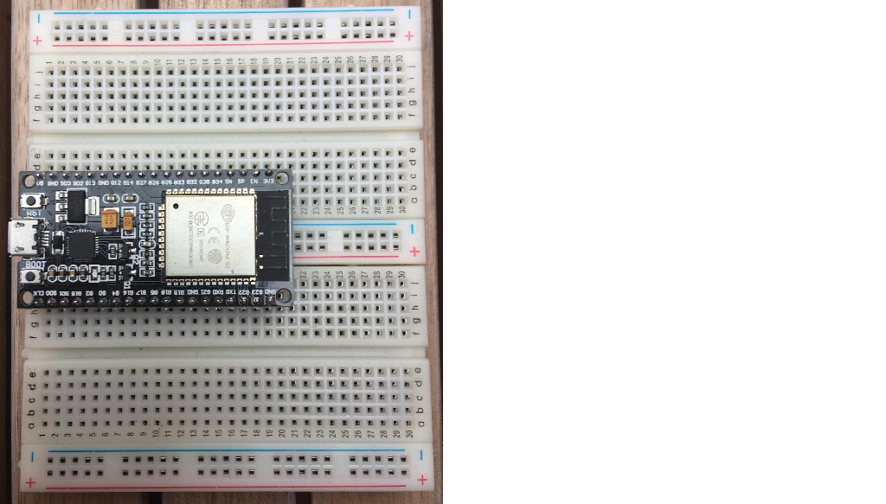
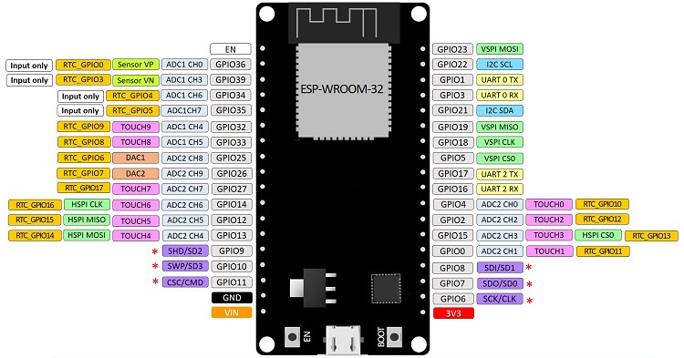
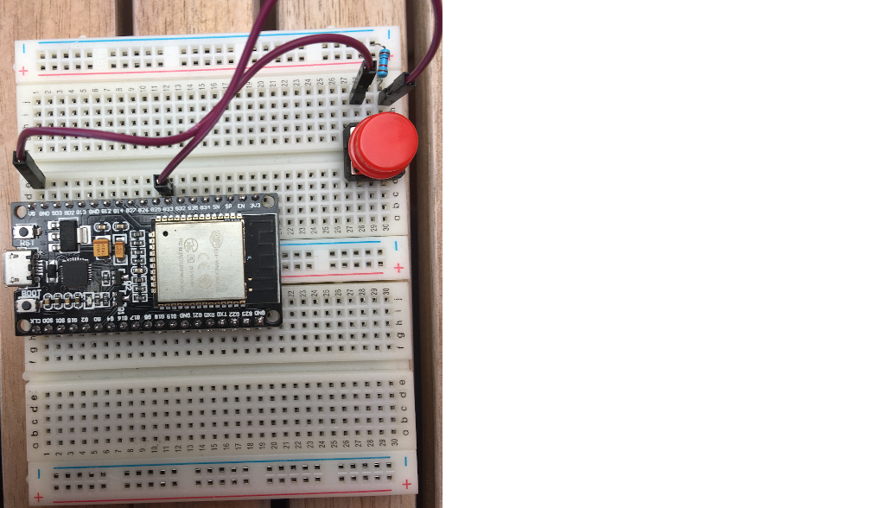

# bleskomat-bills-firmware

The Bleskomat Bills ATM is an offline Bitcoin Lightning Network ATM which accepts fiat bank notes and pays-out bitcoin. It's a great educational tool to give others a practical first experience with Bitcoin's Lightning Network.

You can buy the [Bleskomat Bills ATM](https://shop.bleskomat.com/product/bleskomat-bills-atm/) from the official Bleskomat shop. Alternatively, you can find all the components and equipment needed and build your own.

The Bleskomat Bills ATM must be paired with a server to facilitate Lightning Network payments on its behalf; see the options below:
* [Bleskomat Platform](https://platform.bleskomat.com) - non-custodial, requires a monthly subscription
* [bleskomat-server](https://github.com/bleskomat/bleskomat-server) - non-custodial, open-source, self-hosted solution
* [lnbits](https://github.com/lnbits/lnbits-legend) via the Bleskomat extension - open-source, self-hosted and possible to use custodial instances hosted by others; public instances of lnbits:
	* [legend.lnbits.com](https://legend.lnbits.com) - unstable, don't leave funds on this instance for very long

The rest of this document details the hardware and software requirements, how to build the hardware yourself, and instructions for compiling and uploading the firmware from source.

* [Requirements](#requirements)
	* [Hardware Requirements](#hardware-requirements)
	* [Software Requirements](#software-requirements)
* [Building the Hardware Device](#building-the-hardware-device)
	* [Prepare the breadboards](#prepare-the-breadboards)
		* [ESP32 devkit pinout](#esp32-devkit-pinout)
	* [Wiring the Power Supply](#wiring-the-power-supply)
		* [Optionally power the ESP32 devkit via 5V pin](#optionally-power-the-esp32-devkit-via-5v-pin)
	* [Wiring the E-Paper Module](#wiring-the-e-paper-module)
	* [Wiring the Button](#wiring-the-button)
	* [Wiring the Bill Acceptor](#wiring-the-bill-acceptor)
* [Installing Libraries and Dependencies](#installing-libraries-and-dependencies)
* [Compiling and Uploading to Device](#compiling-and-uploading-to-device)
* [Generate Font Header Files](#generate-font-header-files)
* [Configure Bill Acceptor](#configure-bill-acceptor)
* [Configuring the Device](#configuring-the-device)
	* [List of Configuration Options](#list-of-configuration-options)
	* [Browser-Based Configuration Tool](#browser-based-configuration-tool)
	* [Command-Line Configuration Tool](#command-line-configuration-tool)
	* [Hard-Coded Configuration](#hard-coded-configuration)
* [Changelog](#changelog)
* [Support](#support)
* [License](#license)
* [Trademark](#trademark)


## Requirements

This section includes information about the software and hardware requirements needed to build this project.

### Hardware Requirements

The following list includes all the parts needed to build the commercial Bleskomat ATM. The list includes direct links to suppliers of each part.

Basic components/equipment needed to build your own Bleskomat Bills ATM:
* 2 x breadboard (400-pin)
* Jumper wires (M-M)
* Jumper wires (M-F)
* ESP32 Devkit
* NV10 Bill Acceptor from Innovative Technologies
* WaveShare 4.2 inch E-Paper Module (b/w)
* Button
* 10k ohm resistor
* DC 5.5/2.1 mm DIP adapter
* 12V DC power adaptor (1.5A < 3A)
* Standard USB to micro USB cable

Optional components/equipment:
* Soldering iron
* 2.54 mm pins
* To power the ESP32 devkit from the 12V DC power supply:
	* XL4005 step-down converter
	* USB (F) adapter
	* Alternatively, you could use a USB car charger which includes both a step-down converter and USB (F) output

### Software Requirements

* [make](https://www.gnu.org/software/make/)
* [PlatformIO Core (CLI)](https://docs.platformio.org/en/latest/core/)
	* Version 6 or newer
	* Only the CLI ("Core") is required


## Building the Hardware Device

Before proceeding, be sure that you have all the project's [hardware requirements](#hardware-requirements).


### Prepare the breadboards

One breadboard is not large enough to accommodate all the pins of the ESP32 devkit due to the width of the devkit. This is why we recommend to connect two breadboards together.

Remove one of the power rails from one of the breadboards. Use the notches on the sides of the breadboards to connect them together length-wise.

Insert the ESP32 devkit into the pin holes of the new, combined breadboard.



Familiarize yourself with the ESP32 devkit's pinout reference below.

#### ESP32 devkit pinout




### Wiring the Power Supply

The first step to building the device is wiring the power supply. If already plugged in, __unplug__ the 12V DC power supply now. Connect the DC 5.5/2.1 end of the power supply to the DIP adapter. The positive (+) pins should be the power pins and the negative (-) pins should be the ground. You can use your multimeter to check in case you want to be extra safe:
* Plug-in the power supply to electricity
* Turn on your multimeter and set it to measure voltage in the appropriate range (probably 20V)
* Touch the __red__ lead of your multimeter to one of the positive pins
* Touch the __black__ lead of your multimeter to one of the negative pins
* If you see a negative voltage reading, swap the leads between the two wires
* The pin touched by the __black__ lead is the ground ("GND")
* The pin touched by the __red__ lead is the hot wire ("DC12V")
* Unplug the power supply again

Use a pair of M-F jumper wires to connect the DC 5.5/2.1 DIP adapter to one of the breadboard's power rails. Negative to negative, positive to positive. This rail will be your 12V DC power (positive) and the common ground (negative).

#### Optionally power the ESP32 devkit via 5V pin

If you'd like to make your Bleskomat build a little bit more portable, you can power the ESP32 devkit via its 5V pin. To do this you will need the XL4005 (or equivalent) step-down converter and the USB (F) adapter. Note that powering the ESP32 devkit via its micro USB port requires a regulated voltage of approximately 5V.

It's also possible to use a USB car charger in case you have an extra one lying around.

Connect the step-down converter's input pins to the 12V DC power rail and common ground using (M-F) jumper wires. Use a multimeter to measure the voltage at the out pins. In the case of the XL4005, use a small screwdriver to turn the screw on the little blue box. Turning the screw counter clockwise should lower the voltage, turning it the opposite direction should increase the voltage. Once you have the voltage set to 5V, connect the out pins to the center power rails of the breadboard. This will be your 5V DC power rail.

Use a soldering iron to solder four 2.54 mm pins to the USB (F) DIP adapter. Insert the pins directly into the breadboard wherever you have space available. Using (M-M) jumper wires, connect the negative and positive pins of the USB (F) DIP adapter to the 5V DC power rail.

Connect the negative pin of the 5V DC power rail to the negative of the 12V DC power rail to ensure that they share a common ground. This is important because without a common ground shared between the coin acceptor and ESP32 devkit, the ESP32 will not receive a clean signal from the coin acceptor.

Use a standard USB to micro USB cable to connect the USB (F) DIP adapter to the ESP32 devkit.

There are other options when powering the ESP32 - e.g via the 3.3V pin or the 5V/VIN pin. You should __never__ power the ESP32 via more than one of these options at the same time. For example, do not power the ESP32 via its 3.3V pin while also connecting the ESP32 via USB to your computer. This can damage the ESP32 and possibly also your computer.


### Wiring the E-Paper Module

Connect the E-Paper display module to the ESP32 using the following table as a guide:

| ESP32 | E-Paper Display Module |
|-------|------------------------|
| D25   | BUSY                   |
| D26   | RST                    |
| D27   | DC                     |
| D15   | CS                     |
| D13   | CLK                    |
| D14   | DIN                    |
| GND   | GND                    |
| 3.3V  | VCC                    |

Refer to the [ESP32 devkit pinout](#esp32-devkit-pinout) for help identifying the pins on your ESP32.


### Wiring the Button

Insert button pins into the breadboard wherever you have space available. Typically, its best to place the button at the center of a breadboard (over the gap).

Connect the button using the following table as a guide:

| ESP32    | Button    |
|----------|-----------|
| VIN (V5) | left pin  |
| GPIO33   | right pin |

Connect the right pin of the button to GND with a 10k ohm resistor.



Refer to the [ESP32 devkit pinout](#esp32-devkit-pinout) for help identifying the pins on your ESP32.


### Wiring the Bill Acceptor

This project supports the NV10 (USB+) and NV9 bill acceptors. The SIO protocol is used to communicate with the bill acceptor unit.

|  ESP32       | NV10/NV9 | Power Supply  |
|--------------|----------|---------------|
| GPIO16       | 1 (Tx)   |               |
| GPIO17       | 5 (Rx)   |               |
|              | 16       | - Ground      |
|              | 15       | + 12V DC      |

Refer to the [ESP32 devkit pinout](#esp32-devkit-pinout) for help identifying the pins on your ESP32.


## Installing Libraries and Dependencies

Before proceeding, be sure that you have all the project's [software requirements](#software-requirements).

Use make to install libraries and dependencies for the device firmware:
```bash
make install
```
* The firmware's dependencies are defined in its platformio.ini file located at `./platformio.ini`

If while developing you need to install a new library for the device firmware, use the following as a guide:
```bash
platformio lib install LIBRARY_NAME[@VERSION]
```
You can find PlatformIO's libraries repository [here](https://platformio.org/lib).


## Compiling and Uploading to Device

To compile the firmware (without uploading to a device):
```bash
make compile
```

To compile and upload to your device:
```bash
make upload DEVICE=/dev/ttyUSB0
```
The device path for your operating system might be different. If you receive a "Permission denied" error about `/dev/ttyUSB0` then you will need to set permissions for that file on your system:
```bash
sudo chown $USER:$USER /dev/ttyUSB0
```

To open the serial monitor:
```bash
make monitor DEVICE=/dev/ttyUSB0
```
Again the device path here could be different for your operating system.


## Generate Font Header Files

Each font used to render text on the E-Paper display is loaded from a C-style header file. If you need to add another font, expand the character set of an existing font, or add more font sizes; you will need to generate new font header files.

Have otf2bdf utility installed on your system - available via `apt-get` or `apt` on Ubuntu - e.g `apt-get install otf2bdf`.

Manually build bdfconv from source which is included along with this repository:
```sh
make bdfconv
```
Generate fonts:
```sh
make fonts
```
To manually generate fonts:
```sh
./scripts/generate-font-header-files.sh "/path/to/font/file.ttf" 2 32-382 16,20,24,28,32,36,40,44,48
```
* `2` - this is the build mode
	* "Font build mode, 0: proportional, 1: common height, 2: monospace, 3: multiple of 8". Examples:
		* OpenSans = 1 (common height)
		* Courier Prime Code = 2 (monospace)
		* CheckbookLightning = 1 (monospace)
* `32-382` - this is the character range (e.g. first character = 32, last = 382). More characters = larger header files.
* `6,7,8,9,10,12,14,16,18,20,22,24,28` - comma-separated list of font sizes

Generated font files are written to the ./include/fonts/u8g2 directory.


## Configure Bill Acceptor

Please refer to the following user manuals for detailed instructions regarding how to configure the NV10 (USB+) bill acceptor:
* [NV10 User Manual](docs/NV10-User-Manual-v1.1.pdf)


## Configuring the Device

It is possible to configure the device via the following methods:
* [Browser-Based Configuration Tool](#browser-based-configuration-tool)
* [Command-Line Configuration Tool](#command-line-configuration-tool)
* [Hard-Coded Configuration](#hard-coded-configuration)


### List of Configuration Options

The following is a list of possible configuration options:
* `apiKey.id` - The API key ID of the device. This is needed by the server to verify signatures created by the device.
* `apiKey.key` - The API key secret that is used to generate signatures.
* `apiKey.encoding` - The explicit encoding of the API key secret. This can be "hex", "base64", or empty-string (e.g "") to mean no encoding. When generating a new API key on the server, it will store the encoding along with the ID and secret.
* `callbackUrl` - The LNURL server base URL plus endpoint path. Example:
	* `https://p.bleskomat.com/u`
* `shorten` - Whether or not to shorten the LNURL; see the [lnurl-node module](https://github.com/chill117/lnurl-node#signed-lnurls) for more details.
* `uriSchemaPrefix` - The URI schema prefix for LNURLs generated by the device. It has been discovered that some wallet apps mistakenly only support lowercase URI schema prefixes. Uppercase is better because when encoded as a QR code, the generated image is less complex and so easier to scan. Set this config to empty-string (e.g `uriSchemaPrefix=`) to not prepend any URI schema prefix.
* `fiatCurrency` - The fiat currency symbol for which the device is configured; see [ISO 4217](https://en.wikipedia.org/wiki/ISO_4217).
* `fiatPrecision` - The number of digits to the right of the decimal point when rendering fiat currency amounts.
* `billValues` - The value of bills for which the bill acceptor has been configured. Each value separated by a comma. Integers and floating point (decimal) values are accepted. Examples:
	* CZK: `100,200,500,1000,2000,5000`
	* EUR: `5,10,20,50,100,200,500`
* `billTxPin` - The GPIO connected to the NV10/NV9's Tx pin.
* `billRxPin` - The GPIO connected to the NV10/NV9's Rx pin.
* `billBaudRate` - The baud rate of the SIO protocol communication with the NV10/NV9. This value will be `300` or `9600`.
* `logLevel` - Possible values:
	* `trace` - everything
	* `debug`
	* `info` - default
	* `warn`
	* `error`
	* `none` - nothing
* `webUrl` - The base URL for the web platform. If non-empty, it will be the base URL for:
	* `/intro?id=API_KEY_ID` - URL shown as a QR code on the instructions screen.
* `platformSockUri` - If the device is connected to WiFi and this value is non-empty, a WebSocket connection will be created to the provided URI. Example values:
	* `wss://platform.bleskomat.com/device` -  Uses TLS encryption, must provide the intermediate CA certificate. This can be saved to the device's SPIFFS file system via the [/serial](https://platform.bleskomat.com/serial) tool.
	* `ws://platform.bleskomat.com/device` - Unencrypted WebSocket
* `platformCACert` - The PEM-encoded CA certificate for the platform. This is used to create a secure (TLS) connection to the platform.
* `onlineOnly` - If set to `1` or `true`, then the ATM will only be enabled when connected to the platform.


### Browser-Based Configuration Tool

The Bleskomat Platform provides a [browser-based configuration tool](https://platform.bleskomat.com/serial) to upload pre-built device firmware, view real-time log output, update device configurations, run JSON-RPC serial commands, and more.


### Command-Line Configuration Tool

It is also possible to use the [bleskomat-cli](https://github.com/bleskomat/bleskomat-cli) command-line utility to communicate with a Bleskomat hardware device via JSON-RPC over serial API. Please refer to that project's readme for installation and usage information.


### Hard-Coded Configuration

Hard-coded configurations can be set by modifying the source file [config.cpp](https://github.com/bleskomat/bleskomat-bills-firmware/blob/master/src/config.cpp#L201).

Each time you make changes to the hard-coded configurations, you will need to re-compile and flash the ESP32's firmware.


## Changelog

See [CHANGELOG.md](https://github.com/bleskomat/bleskomat-bills-firmware/blob/master/CHANGELOG.md)


## Support

Need some help? Join us in the official [Telegram group](https://t.me/bleskomat) or send us an email at [support@bleskomat.com](mailto:support@bleskomat.com) and we will try our best to respond in a reasonable time. If you have a feature request or bug to report, please [open an issue](https://github.com/bleskomat/bleskomat-bills-firmware/issues) in this project repository.


## License

The project is licensed under the [GNU General Public License v3 (GPL-3)](https://tldrlegal.com/license/gnu-general-public-license-v3-(gpl-3)):
> You may copy, distribute and modify the software as long as you track changes/dates in source files. Any modifications to or software including (via compiler) GPL-licensed code must also be made available under the GPL along with build & install instructions.


## Trademark

"Bleskomat" is a registered trademark. You are welcome to hack, fork, build, and use the source code and instructions found in this repository. However, the right to use the name "Bleskomat" with any commercial products or services is withheld and reserved for the trademark owner.
