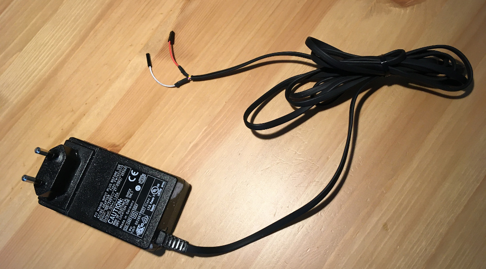

# bleskomat-device

The Lightning Network ATM with simple components and a simple setup - just plug it in and it works!

* [Overview](#overview)
* [Requirements](#requirements)
	* [Hardware Requirements](#hardware-requirements)
		* [Parts Suppliers](#parts-suppliers)
	* [Software Requirements](#software-requirements)
* [Setup](#setup)
	* [Building the Hardware Device](#building-the-hardware-device)
		* [Wiring Diagram](#wiring-diagram)
		* [Wiring the Power Supply](#wiring-the-power-supply)
		* [Wiring the E-Paper Module](#wiring-the-e-paper-module)
		* [Wiring the SD Card SPI Module](#wiring-the-sd-card-spi-module)
		* [Wiring the Bill Acceptor](#wiring-the-bill-acceptor)
		* [Wiring the Coin Acceptor](#wiring-the-coin-acceptor)
	* [Configure and Train Coin Acceptor](#configure-and-train-coin-acceptor)
	* [Installing Libraries and Dependencies](#installing-libraries-and-dependencies)
	* [Generating Your Local Config File](#generating-your-local-config-file)
	* [Compiling and Uploading to Device](#compiling-and-uploading-to-device)
	* [Prepare SD Card](#prepare-sd-card)
* [Fonts](#fonts)
* [License](#license)


## Overview

Key features include:
* Works offline - no WiFi required
* Inexpensive, easily-sourced components
* Easily hackable and extendible

The project consists of two parts:
* __Physical Device (ATM)__ - user inserts bills or coins, device generates a signed URL and displays as QR code, user's app (which supports lnurl-withdraw) scans QR code and makes request to HTTP server, withdraw process is completed and the user has successfully bought satoshis with fiat money.
* __HTTP Server__ - supports [lnurl-withdraw](https://github.com/btcontract/lnurl-rfc/blob/master/lnurl-withdraw.md) with additional request handlers for fiat-currency -> satoshi conversion and request signing.

This repository contains the source and build instructions for the physical device. The source code and documentation for the HTTP server component is located in a [separate repository](https://github.com/samotari/bleskomat-server).


## Requirements

This section includes information about the requirements (software + hardware) that you will need to build the physical Bleskomat ATM.


### Hardware Requirements

To build the physical device, you will need the following hardware components:
* [ESP-WROOM-32](https://www.espressif.com/en/products/modules/esp-wroom-32/overview) by espressif
	* [laskarduino.cz](https://www.laskarduino.cz/iot-esp-32s-2-4ghz-dual-mode-wifi-bluetooth-rev-1--cp2102/)
* [WaveShare 4.2 inch E-Paper Module (b/w)](https://www.waveshare.com/wiki/4.2inch_e-Paper_Module):
	* [laskarduino.cz](https://www.laskarduino.cz/waveshare-4-2--400x300-epaper-displej-modul-bw/)
* SD Card SPI Module:
	* [laskarduino.cz](https://www.laskarduino.cz/sd-card-modul-spi/)
* Bill Acceptor - [NV10](https://innovative-technology.com/products/products-main/127-nv10-usb)
* Coin Acceptor - "Model HX-616"
* 12V DC power adapter (1.5A < 3A):
	* [GME](https://www.gme.cz/napajeci-zdroj-sitovy-12v-2500ma-5-5-2-1mm-t3-sys1588-3012-t3)
* USB (female) adapter:
	* [laskarduino.cz](https://www.laskarduino.cz/usb-f-na-dip-adapter/)
* Step-down converter:
	* [laskarduino.cz](https://www.laskarduino.cz/step-down-menic-s-xl4005/)
* Relay module:
	* [laskarduino.cz](https://www.laskarduino.cz/1-kanal-5v-rele-modul--low-level--250vac-10a/)
* Button:
	* [GME](https://www.gme.cz/) has many available


#### Parts Suppliers

* [GM Electronic](https://www.gme.cz/):
	* physical shop
	* tools and electronics parts
	* usually missing most components and not the most helpful staff
* [laskarduino](https://www.laskarduino.cz/):
	* eshop only
	* hobby electronics projects
	* cheap and good selection
* [arduino-shop](https://arduino-shop.cz/):
	* eshop only
	* expensive and limited selection
* [COMAX LEISURE CZ,a.s.](https://www.akceptory-bankovek.cz/)
	* NV10 and other bank note acceptors
	* physical shop
	* Modletice 71, 251 70 MODLETICE
	* info@comax.cz
	* Main contact:  "Martin Zych" - martin.zych@comax.cz


### Software Requirements

* [PlatformIO Core (CLI)](https://docs.platformio.org/en/latest/core/)
* [nodejs](https://nodejs.org/) - For Linux and Mac install node via [nvm](https://github.com/creationix/nvm)


## Setup

Step-by-step setup process including both hardware and software.


### Building the Hardware Device

Before proceeding, be sure that you have all the project's [hardware requirements](#hardware-requirements).


#### Wiring Diagram

Here is a wiring diagram for the Bleskomat ATM:


#### Wiring the Power Supply

The first step to building the device is wiring the power supply. If already plugged in, __unplug__ the 12V DC power supply now. Use scissors to cut the end off the power supply so that you can freely access the two wires within, as shown in the following image:



It is important to test the wires to know for certain which is the ground. Use a [multimeter](https://duckduckgo.com/?q=multimeter&t=canonical&iar=images&iax=images&ia=images) to measure the voltage of the power supply:
* Plug-in the power supply to electricity
* Turn on your multimeter and set it to measure voltage in the appropriate range
* Touch the __red__ lead of your multimeter to one of the wires
* Touch the __black__ lead of your multimeter to the other wire
* If you see a negative voltage reading, swap the leads between the two wires
* The wire touched by the __black__ lead is the ground ("GND")
* The wire touched by the __red__ lead is the hot wire ("PWR")
* Unplug the power supply again

Now use the [wiring diagram](#wiring-diagram) above as a guide to wire the ESP32 to the power supply.

Note that powering the ESP32 via its micro USB port requires a regulated voltage of approximately 5V. The suggested step-down converter is the [XL4005](https://www.laskarduino.cz/step-down-menic-s-xl4005/). It does a good job of keeping a steady voltage and doesn't generate much heat.

Once you've connected the step-down converter to the power supply, use your multimeter to measure the voltage at the out pins. Use a small screwdriver to turn the screw on the little blue box. Turning the screw counter clockwise should lower the voltage, turning it the opposite direction should increase the voltage. Once you have the voltage set to 5V, you can connect the USB (F) adapter to the out pins.

Use a standard USB to micro USB cable to connect the ESP32.

Do not forget to connect the ESP32 to the common ground. Without this connection, the ESP32 will not be able to receive pulses from the coin acceptor when the ESP32 is connected to your computer via USB.

There are other options when powering the ESP32 - e.g via the 3.3V pin or the 5V/VIN pin. You should __never__ power the ESP32 via more than one of these options at the same time. For example, do not power the ESP32 via its 3.3V pin while also connecting the ESP32 via USB to your computer. This can damage the ESP32 and possibly also your computer.


#### Wiring the E-Paper Module

Connect the E-Paper display module to the ESP32 using the following table as a guide:

| ESP32 | E-Paper Display Module |
|-------|------------------------|
| D25   | BUSY                   |
| D26   | RST                    |
| D27   | DC                     |
| D15   | CS                     |
| D13   | CLK                    |
| D14   | DIN                    |
| GND   | GND                    |
| 3.3V  | VCC                    |


#### Wiring the SD Card SPI Module

Connect the SD card SPI module to the ESP32 using the following table as a guide:

| ESP32 | SD Card SPI Module |
|-------|--------------------|
| GND   | GND                |
| 3.3V  | 3.3                |
|       | 5                  |
| D5    | CS                 |
| D23   | MOSI               |
| D18   | SCK                |
| D19   | MISO               |
| GND   | GND                |


#### Wiring the Bill Acceptor

Have a look at the [wiring diagram](#wiring-diagram) above or the table of cable mappings below:

|  ESP32      | NV10 | Power Supply  |
|-------------|------|---------------|
| GPIO3 (RX0) | 1    |               |
|             | 16   | - Ground      |
|             | 15   | + 12V DC      |


#### Wiring the Coin Acceptor


|  ESP32      | DG600F   | Power Supply  |
|-------------|----------|---------------|
| GPIO21      | INHIBIT  |               |
| GPIO16      | SERIAL   |               |
|             | COUNTER  |               |
|             | GND      | - Ground      |
|             | 12V DC   | + 12V DC      |


### Configure and Train Coin Acceptor

Physical switches on the DG600F should set as follows:

| Switch           | State         |
|------------------|---------------|
| 1 (Port Level)   | Down (NO)     |
| 2 (Security)     | Down (Normal) |
| 3 (Transmitting) | Up (RS232)    |
| 4 (Inhibiting)   | Down (> +3V)  |


Open the [DG600F manual](docs/DG600F-coin-acceptor-manual.pdf) to "Coin Acceptor Parameters Setting" on page 18. Set the parameters as follows:

| Parameter | Description                      | Value | Meaning                           |
|-----------|----------------------------------|-------|-----------------------------------|
| A1        | machine charge amount            | 01    | min. coin value before data sent  |
| A2        | serial output signal pulse-width | 01    | 25ms / 9600 bps (RS232 baud rate) |
| A3        | faulty alarm option              | 01    | (rings only one time)             |
| A4        | serial port RS232 signal length  | 01    | one byte                          |
| A5        | serial port output               | 01    | output to serial pin              |


To train the coin acceptor, have a look at "Coin Parameters Setting" on page 16 of the [DG600F manual](docs/DG600F-coin-acceptor-manual.pdf). Be sure to set the "coin value" for each coin in series, incremented by 1. For example:
* 1 CZK = 1 coin value
* 2 CZK = 2 coin value
* 5 CZK = 3 coin value
* 10 CZK = 4 coin value
* 20 CZK = 5 coin value
* 50 CZK = 6 coin value

Then in bleskomat.conf, set the `coinValues` setting as follows:
```
coinValues=1,2,5,10,20,50
```


### Installing Libraries and Dependencies

Before proceeding, be sure that you have all the project's [software requirements](#software-requirements).

First thing to do is to install npm dependencies:
```bash
npm install
```
Node is used as a task runner and to generate new (or read existing) API keys.

Next you will need to install required libraries for the C/C++ builds:
```bash
platformio lib install
```
See the `platformio.ini` file for a list of libraries that will be downloaded and installed.

If while developing you need to install a new library, use the following command as a guide:
```bash
platformio lib install --save LIBRARY_NAME[@VERSION]
```
The `--save` flag tells platformio to add the library to the project's `platformio.ini` file.

You can find PlatformIO's libraries repository [here](https://platformio.org/lib).


### Generating Your Local Config File

A helper script is used to generate the local configuration file that is needed to connect to the server's Postgres database, encrypt/decrypt sensitive data (like API key secrets), and to set other required configuration options for the device build process. Let's get started:
```bash
npm run config -- init
```
This will walk you thru the process of generating the local config file.

You can choose to generate an encrypted or decrypted config file. You should note that the build process will require an unencrypted config file in order to run. It is possible to decrypt the config file as follows:
```bash
npm run config -- decrypt
```
Or to encrypt it:
```bash
npm run config -- encrypt
```


### Compiling and Uploading to Device

To compile the project (without uploading to a device):
```bash
npm run compile:only
```
To run the build with dummy/invalid API-key-related build flags:
```bash
npm run compile:only
```

To compile and upload to your device:
```bash
DEVICE=/dev/ttyUSB0 npm run compile:upload
```
The device path for your operating system might be different. If you receive a "Permission denied" error about `/dev/ttyUSB0` then you will need to set permissions for that file on your system:
```bash
sudo chown $USER:$USER /dev/ttyUSB0
```
To run the build with dummy/invalid API-key-related build flags:
```bash
DEVICE=/dev/ttyUSB0 npm run compile:upload
```

To open the serial monitor:
```bash
DEVICE=/dev/ttyUSB0 npm run monitor
```
Again the device path here could be different for your operating system.


## Prepare SD Card

Before continuing here, see [Wiring the SD card](#wiring-the-sd-card).

Format the SD card with FAT32. Create a configuration file with the following command:
```bash
npm run print:config "6d830ddeb0" > ./bleskomat.conf
```
This will generate a new configuration file named `bleskomat.conf` for the API key ID `"6d830ddeb0"`. The contents of the config file will be something like this:
```
apiKey.id=6d830ddeb0
apiKey.key=b11cd6b002916691ccf3097eee3b49e51759225704dde88ecfced76ad95324c9
apiKey.encoding=hex
callbackUrl=https://0fe4d56b.eu.ngrok.io/lnurl
fiatCurrency=CZK
shorten=true
```
Copy this file to the SD card.

You can also print dummy configuration values by omiting the API key ID:
```bash
npm run print:config > ./bleskomat.conf
```


## Fonts

Each font used to render text on the E-Paper display is loaded from a C-style header file. If you need to add another font family or size, you will need to:
* [Install fontconvert dependencies](#install-fontconvert-dependencies)
* [Build The Adafruit GFX fontconvert tool from source](#build-the-adafruit-gfx-fontconvert-tool-from-source)
* Download the font(s) you want in `.ttf` format
* [Generate Font Header File](#generate-font-header-file)


### Install fontconvert dependencies

On Ubuntu it's pretty simple:
```bash
sudo add-apt-repository ppa:glasen/freetype2 \
	&& sudo apt-get update \
	&& sudo apt-get install -yq freetype2-demos libfreetype6 libfreetype6-dev
```

### Build The Adafruit GFX fontconvert tool from source

```bash
cd .pio/libdeps/bleskomat32/Adafruit\ GFX\ Library/fontconvert \
	&& make
```
Alternatively, you can find the fontconvert source and build scripts in the [Adafruit GFX Library repository](https://github.com/adafruit/Adafruit-GFX-Library/tree/master/fontconvert).


### Generate Font Header File

On Linux, your installed fonts can be found at `~/.local/share/fonts`. Or you can download fonts from the many font collections online. You will need fonts in `.ttf` format. There are tools that can convert other formats to `.ttf`, but that's outside the scope of this section.

Use the following command to generate a font header file:
```bash
./scripts/generateFontHeaderFile.sh ~/.local/share/fonts/OpenSans/Light/OpenSans-Light.ttf 16
```
This will generate a new header font file at `./include/fonts/OpenSans_Light16pt7b.h`. You will need to include the new font in the `./includes/modules/epaper.h` file as follows:
```cpp
// ...

#include "fonts/OpenSans_Light16pt7b.h"

// ...
```
And then use the font in `./src/modules/epaper.cpp` as follows:
```cpp
const std::string text = "Using a new font";
int16_t x = display.width() / 2;// center
int16_t y = display.height() / 2;//center
TextBoundingBox text_box;
renderText(text, &OpenSans_Light16pt7b, x, y, &text_box);
```


## License

This project is "unlicensed" meaning all copyrights are withheld. This is the closed-source, extended version of the device for the commercial Bleskomat ATMs.

There is an [open-source version](https://github.com/samotari/bleskomat) of this project that hackers and hobbyist are welcome to use as a guide to build their own Bleskomat ATMs.
